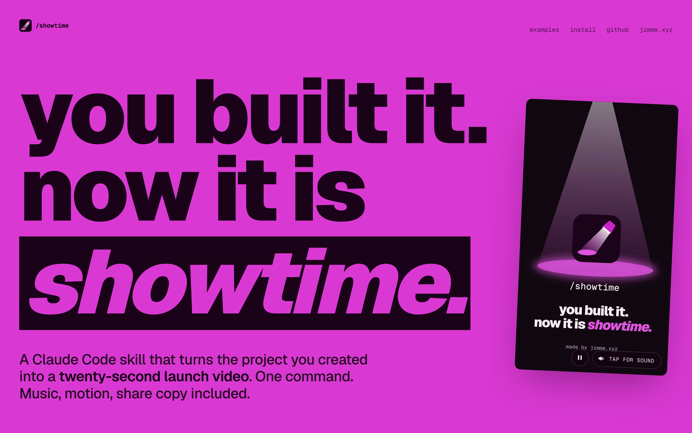

# Showtime by jimme.xyz

**You built it. Now it is showtime.**



Showtime is a Claude Code skill, run with `/showtime`, that turns your website, app, project, or idea into a short, professional demo video — music, motion, and share copy included. One command, powered by [Hyperframes](https://hyperframes.heygen.com/).

Made by [jimme.xyz](https://jimme.xyz).

## Install

```bash
/plugin marketplace add Swanta8/showtime
/plugin install showtime@showtime
```

Then run `/showtime` inside any project, or give it a URL or an idea from anywhere.

**Any other agent** — one command via the [`skills`](https://github.com/vercel-labs/skills) CLI (Cursor, Codex, Copilot, Gemini CLI, opencode, and more):

```bash
npx skills add https://github.com/Swanta8/showtime --skill showtime
```

Add `-g` to install globally (available in every project); drop it to scope to the current one.

<details>
<summary>No installer? Copy the skill directly.</summary>

```bash
rsync -a --exclude '.DS_Store' skills/showtime/ ~/.claude/skills/showtime/
```

Restart Claude Code after copying.
</details>

### Also works with

This repo exposes the skill at every agent's standard discovery path via symlinks. No extra config needed.

| Agent | How it discovers |
|---|---|
| **Google Antigravity** | Auto-detects from `.agents/skills/showtime/` at project root or `~/.gemini/config/skills/showtime/` globally |
| **opencode** | Auto-detects from `.opencode/skills/showtime/` at project root |
| **Codex CLI** | Reads `.agents/skills/showtime/`, walking up to repo root |
| **Claude Code** | Also reads `.claude/skills/showtime/` (in addition to the `.claude-plugin/` marketplace install above) |
| **Other agents** | Point custom instructions at `skills/showtime/SKILL.md` — see [`docs/other-agents.md`](docs/other-agents.md) |

> **Windows users:** Git requires `git config core.symlinks true` (or `git clone -c core.symlinks=true`) and Windows Developer Mode or Administrator privileges to create symlinks. If symlinks don't work on your system, copy `skills/showtime/` to the agent's skill directory manually instead.

## Use it

Give `/showtime` whatever you have. It works out the source from what you type:

| You have | Type | What it uses |
|---|---|---|
| **A project on your machine** | `/showtime` (inside the project folder) | The code: pages, styles, components, README |
| **A live website** | `/showtime https://example.com` | Screenshots, colors, fonts, text, and images from the site |
| **An app running locally** | `/showtime http://localhost:3000` | The same as a website, straight from your dev server |
| **A GitHub repo** | `/showtime https://github.com/owner/repo` | A read-only copy of the code, plus the live demo if the README links one |
| **An idea, nothing built yet** | `/showtime --idea "a budgeting app that roasts your spending"` | Your description; it designs the UI mockups itself and presents the video as a concept |
| **Screenshots or mockups** | `/showtime ./screens/home.png ./screens/result.png` | Your images as the real UI, animated in order |

Screenshots can also be added next to any other source as extra material.

A few things to know:

- **Websites:** only public pages are captured. Showtime never logs in or fills in forms; for a page behind a login, use screenshots instead. Screenshots stay on your machine. Make a video of someone else's site only with their permission.
- **Repos:** the code is read, never installed or run.
- **Ideas:** the share copy says it is a concept or coming soon, never that it already ships.
- **Privacy:** secrets, API keys, and real customer data never end up in the video; real-looking stand-ins are used instead.

## Options

Add any of these after the source. They all combine.

| Option | What it does | Default |
|---|---|---|
| `--duration <seconds>` | Length of the video, up to 60 seconds | 15–25 seconds, picked to fit |
| `--format <shape>` | `landscape` (YouTube, websites), `vertical` (Reels, TikTok, Shorts), or `square` (LinkedIn, feeds) | `landscape` |
| `--tone <preset or description>` | The style: `default`, `polished`, `yc-parody`, `chaotic`, `deadpan`, `cinematic`, `app-store`, or your own words | Picked to fit the product |
| `--title "<name>"` | The product name shown in the video | Taken from the source |
| `--idea "<description>"` | Make a concept video of something that is not built yet | — |
| `--voice` | Adds a voiceover (Kokoro, through Hyperframes) | Off |
| `--no-music` | Leaves out the music | Music on |
| `--no-sfx` | Leaves out the sound effects | Sound effects on |

Examples:

```text
/showtime --duration 45
/showtime https://example.com --duration 30 --format vertical
/showtime --tone "fake Series A launch from 2016"
/showtime http://localhost:3000 --tone app-store --voice
/showtime --idea "a budgeting app that roasts your spending" --format square
```

## What you get

You get a `showtime-output/` folder with the plan, a composition brief, share copy, a poster image, and the rendered `showtime.mp4`. For a website or repo, the captured pages or cloned code sit in the same folder.

## How it works

`/showtime` owns the story — the product angle, tone, and which moments to show. It reads the source (code, a captured website, a repo, your idea, or your screenshots), plans a storyboard, and hands a focused brief to [Hyperframes](https://hyperframes.heygen.com/), which builds, times, and renders the video.

## Requirements

- An agent that supports Agent Skills — Claude Code, opencode, Codex CLI, or any agent with custom instructions (see "Also works with" above)
- Node.js 22+
- FFmpeg on `PATH`
- Hyperframes CLI — `npx hyperframes` (check it with `npx hyperframes doctor`)

## What's in this repo

- `skills/showtime/` — the skill, references, and bundled music + SFX
- `docs/` — the launch site (GitHub Pages)
- `.claude-plugin/` — plugin manifest + marketplace catalog
- `.claude/skills/showtime/` — symlink → `skills/showtime/` (Claude Code discovery)
- `.agents/skills/showtime/` — symlink → `skills/showtime/` (Codex CLI + opencode discovery)
- `.opencode/skills/showtime/` — symlink → `skills/showtime/` (opencode discovery)

## Credits

- Music — [ende.app](https://ende.app/en) "Happy Beats / Business Moves"
- Sound effects — [Kenney](https://kenney.nl/)
- Video generation — [Hyperframes](https://hyperframes.heygen.com/)

## Contributing

Contributions, ideas, and new demo showtimes are welcome — open an issue or a PR.
